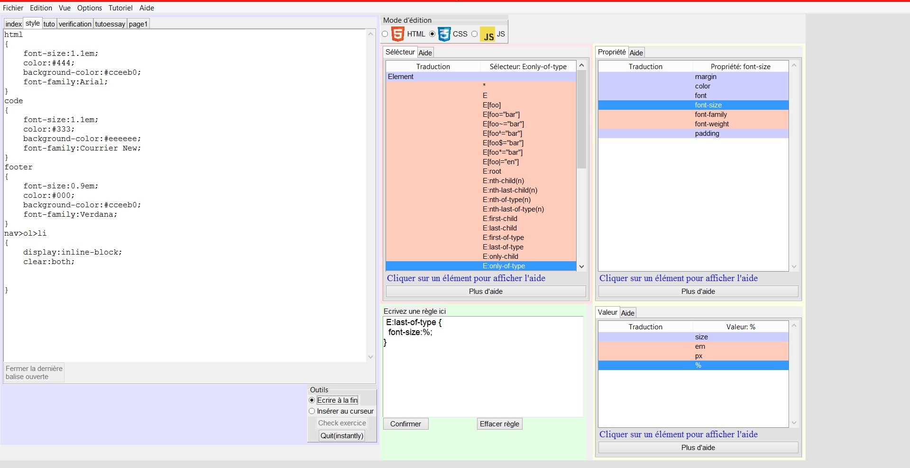

# WebSpree

Text editor for Web-related technologies

## What ?

  WebSpree is a desktop text editor built around HTML CSS and JS, It will help you in this huge jungle of many keywords and guide you with integrated tutorials and progression guides.
  
  Here's a screeshot of what it looks like.(early 2015): 
  
  

## Features

 * Text Editor
 * Built-in Tutorials
 * Built-in Documentation about HTML, CSS
 * Light
 * Tabbed Editor
 * Macros
 * Find Replace Indent
 * Cross Platform

## How to run the sofware ?

* If you use a Mac [click here first](https://www.python.org/download/mac/tcltk/)
* [Download WebSpree](https://github.com/GrosSacASac/WebSpree/archive/master.zip)
* Unzip it
* [Download Python 3](https://www.python.org/downloads/)
* Double Click `WebSpree_beta.py` or
* right click `WebSpree_beta.py` -> Edit with IDLE -> `F5` on the keyboard

## Platform tests

* Test all ok for Windows Vista, 7, 8, 10.
* On Mac there are some minor problems but should be ok for basic use.
* Not tested yet on Linux.

## Updates

  You can see the complete patch notes in the Documentation in [Patch_Notes.html](http://rawgit.com/GrosSacASac/WebSpree/master/Documentation/Patch_Notes.html).
  
  
## How to join and contribute ?

  Look for To_do.html in the Documentation folder. Open issues filled with details.

## Developpement Status

  5/10 :: Early alpha - Heavy changes are made.
  
## How does it work ?

   Uses python and tkinter ui. Read the technical specification for more details.
  
  

